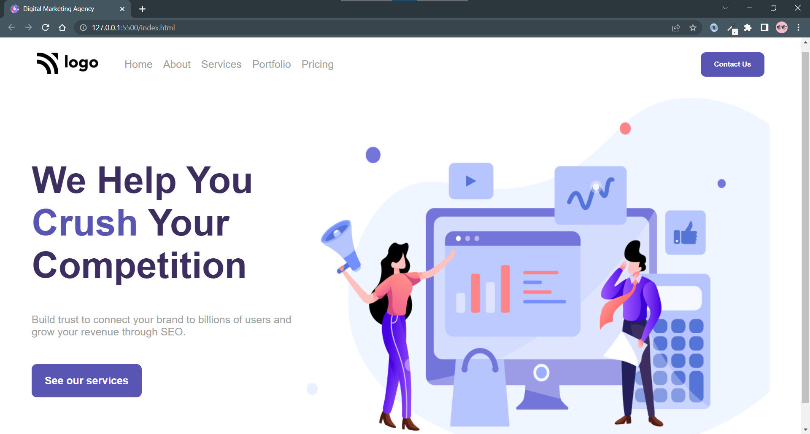

> # I am Sandeep Pal 🙏
👉 This is my fourth project on HTML and CSS.

👉 Digital Marketing Agency Website

> # Learning
1️⃣ Manage big large images
 
 ✳️ Manage large picture i use to firstly give the width of image 100%
 `img{width:100%}`then use there parent div decrease the width of image parent automatically image size to  decrease and looking small and good.

__USE__⚡

```HTML
img{
    width:100%;

}

div{

    width:50%
}
```

> ## TIME🕑

🔛 It takes 2 Hour to complte this project.

> ### About More
⚠️ Website are not responsive but ASAP i make them responsive.

⚠️ Website was not complete all the feature of
website comes later days.

🔁 Update comes in future 


  
